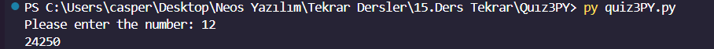

<h1><i>QUIZ-3 PYTHON</i></h1>
<h3>Even or Odd Number Checker</h3>

This Python script checks whether a number entered from the keyboard is even or odd. It also performs additional operations based on the parity of the number.

<h3>Features</h3>

Even or Odd Check: Determines whether the entered number is even or odd and prints the result to the screen.

Number Transformation: If the entered number is odd, appends the number 345 as a string to its end; if it's even, appends the number 125 as a string to its end. Then, it doubles this new number and prints the result.

